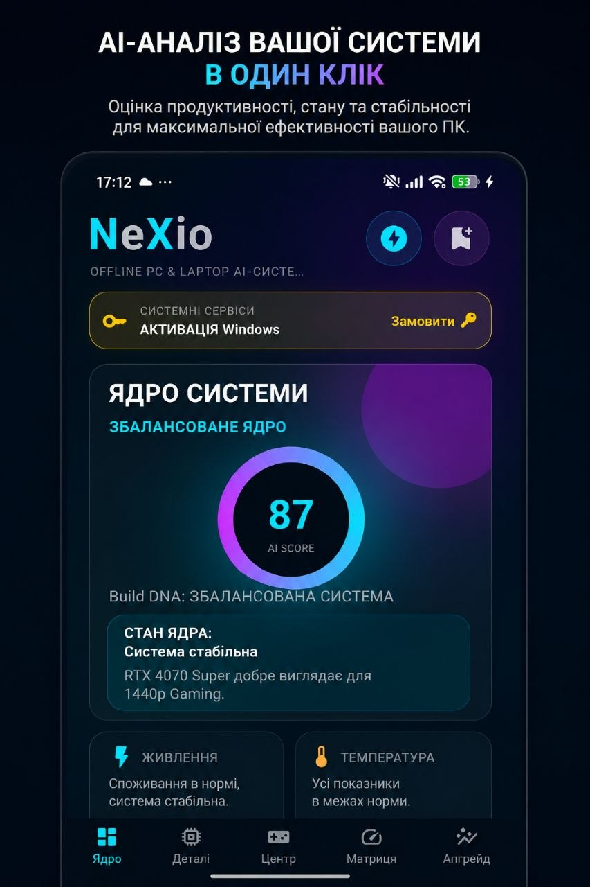
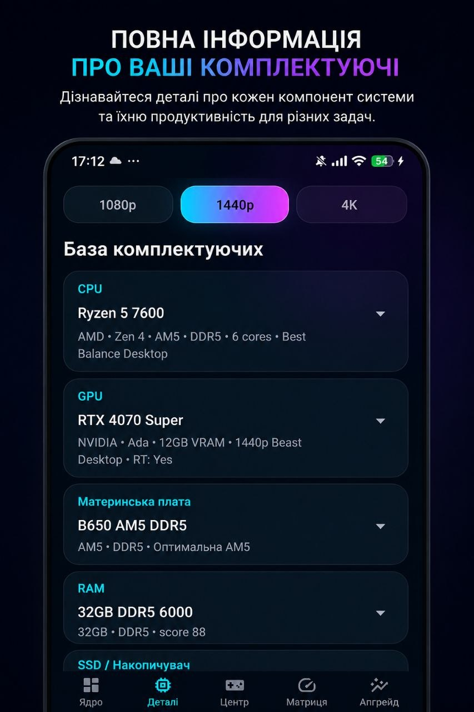
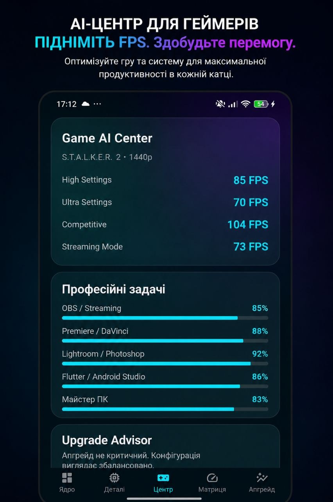
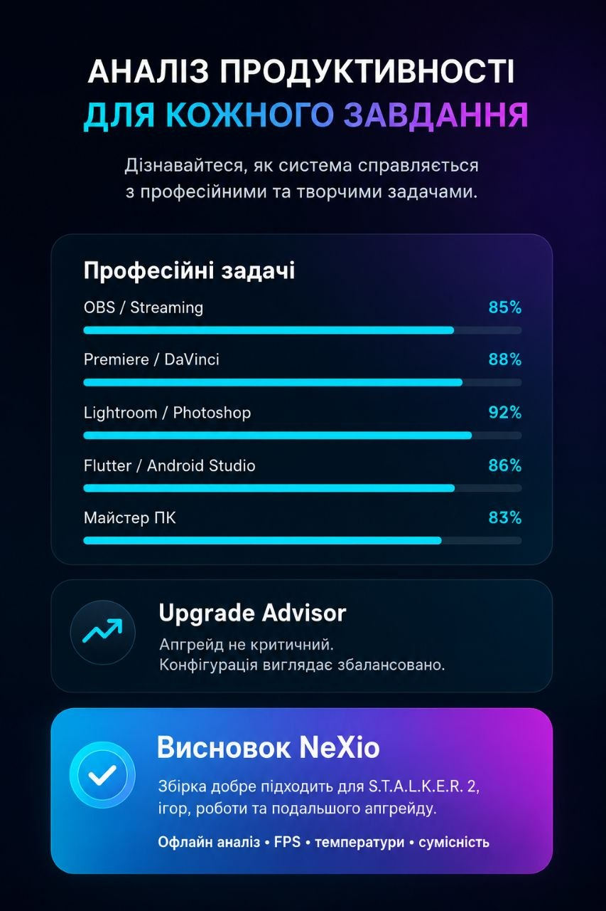

# NeXio-PC

## Build Your Dream PC

NeXio-PC is a modern Flutter application for building and analyzing computer configurations.

## Features

- PC Builder
- Component Compatibility
- FPS Prediction
- Bottleneck Calculator
- Power Consumption
- Temperature Analysis
- Gaming Performance
- Build Rating
- Offline Database
- Modern NeXio Design

## Components

- CPU
- GPU
- Motherboards
- RAM
- SSD
- HDD
- Power Supplies
- Cooling
- Cases

## Gaming

Performance estimation for popular games.

## Mission

Create a beautiful and practical PC building application for gamers and professionals.

---

NeXio © Digital Innovation
---

# Application Screenshots

## Hardware Database

## CPU & GPU Selection

## Performance Modes

## PC Build Analysis

